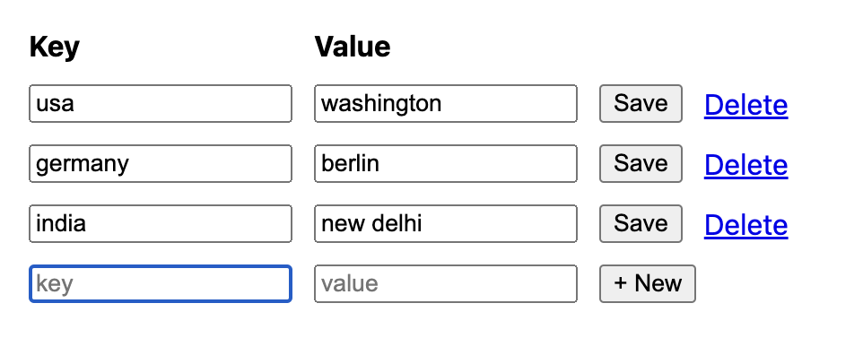

# cookeys

A key-value store backed by cookies. This repo supplements a blog post I wrote:
[Cookies are a distributed storage mechanism](https://dietcode.io/p/cookies)



### DIY

1. Install dependencies:

```bash
bun install
```

2. Run server:

```bash
bun run --bun --hot index.tsx
```

3. Open up `http://localhost:8000`
